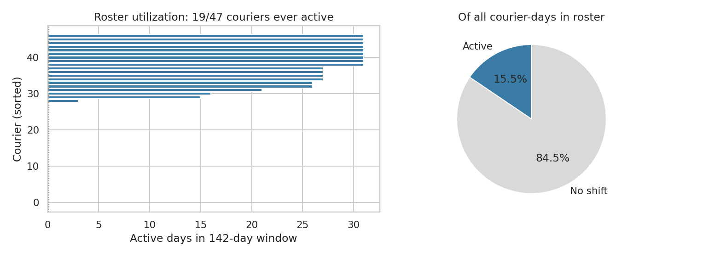
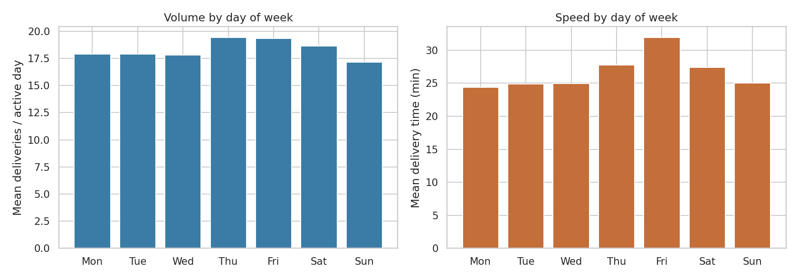
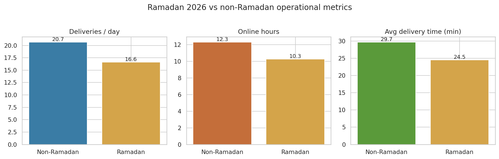
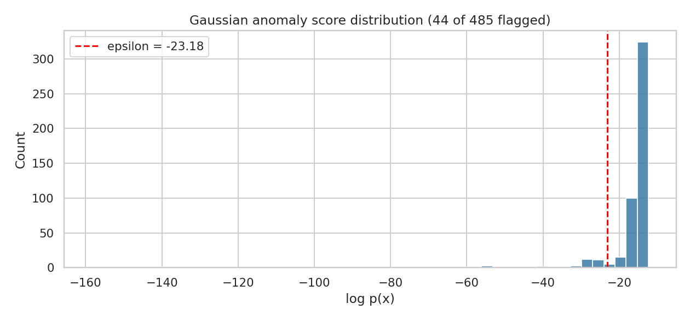
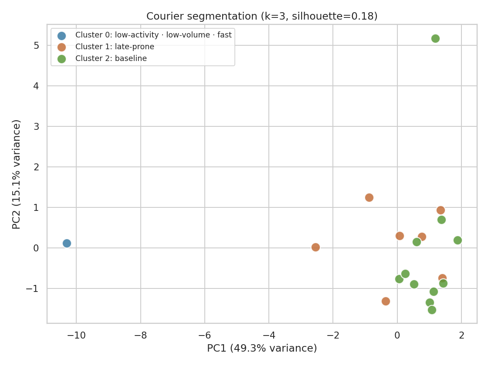
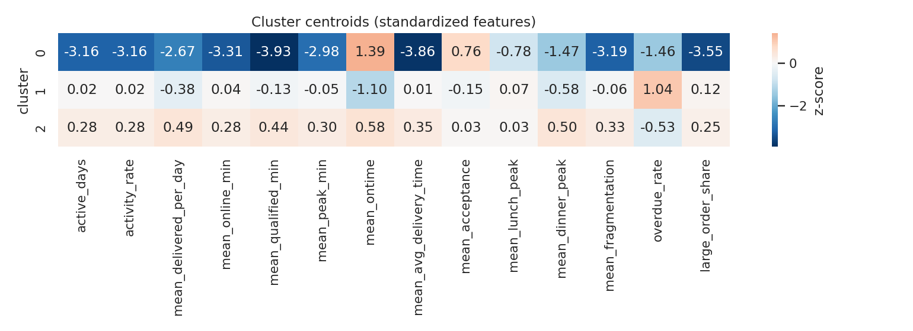
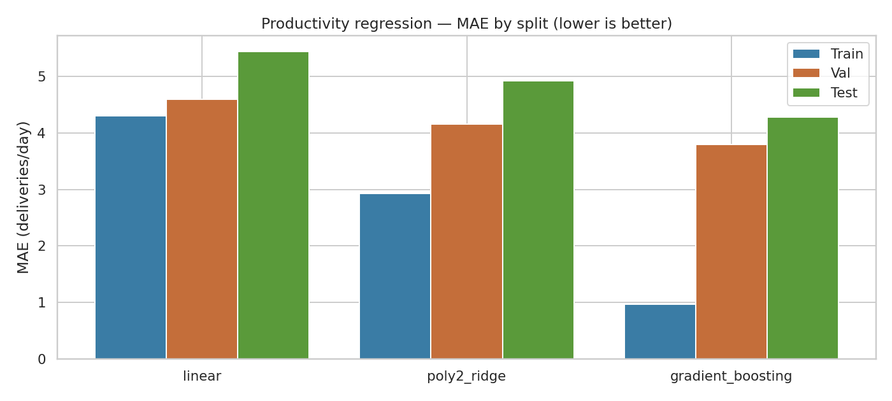
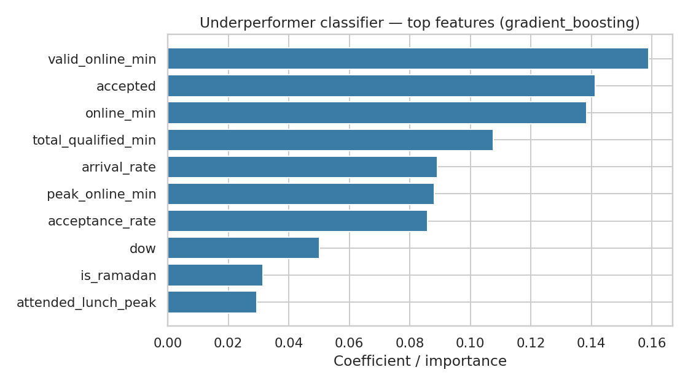

# Keeta Courier Analytics

**Multi-month operational machine learning on real food-delivery courier data**

A portfolio capstone built on **3184 courier-days × 47 couriers × 142 days** of real Keeta operational scorecards from a Saudi 3PL fleet. End-to-end pipeline: cleaning, feature engineering, anomaly detection, segmentation, regression, and classification — every model exercised on the actual data, every finding tied to an operational lever.

> Six of nine DeepLearning.AI / Stanford ML Specialization weeks exercised on real production data. No toy datasets. No synthetic numbers. No copied notebooks.

---

## Headline findings

| # | Finding | Number |
|---|---|---|
| 1 | Roster utilization | **28 of 47 couriers (60%) had zero shifts in 142 days** |
| 2 | Friday is the slowest day despite highest online time | 32.0 min Fri vs 24.4 min Mon (+31% slower) |
| 3 | Ramadan reduces volume but speeds delivery | -19% volume, -17% online hours, **-17% delivery time** |
| 4 | Gaussian anomaly detection (C3W1) | Validation **F1 = 0.696**, 44 of 485 active days flagged |
| 5 | Three courier archetypes (K-Means + PCA, C3W1+W2) | 1 outlier · 7 mid-tier late-prone · 11 baseline performers |
| 6 | Productivity regression (linear → poly+L2 → boosting) | Best **test R² = 0.50**, MAE = 4.28 deliveries/day |
| 7 | Underperformer classifier (logreg vs gradient boosting) | Best **test AUC = 0.90**, F1 = 0.57 |

Each finding is accompanied by a *so-what* operational recommendation in the [notebook](notebooks/courier_analytics.ipynb).

---

## Why this project

Most ML capstones run on Kaggle datasets with no real-world stakes. This one runs on **the actual operational scorecard** of a working Saudi 3PL fleet — courier-day records exported from the Keeta delivery platform. The goal is to demonstrate:

1. **End-to-end engineering on messy production data** — the export ships with `"-"` placeholders, time strings like `"11 hr, 54 min"`, a structured pipe-delimited attendance summary, and PII in plain text. The pipeline handles all of it.
2. **Modeling discipline** — every supervised model is evaluated with a 60/20/20 Train/Val/Test split. Bias-variance is read from the gap between splits, not just from final test scores.
3. **Operational interpretation** — every finding ends with a specific lever the fleet operator can pull. ML output that isn't tied to action isn't useful.

---

## Results gallery

### Roster utilization


19 of 47 couriers ever logged a qualified shift. The remaining 28 are dormant for the entire 142-day window — admin overhead with zero output.

### Day-of-week pattern


Friday is the longest-online day but produces the slowest deliveries. Customer-experience risk lives in that 7-minute gap.

### Ramadan effect


The most counterintuitive finding: deliveries drop 19% but the surviving deliveries are 17% *faster*. The constraint during Ramadan is courier supply, not dispatch difficulty.

### Gaussian anomaly detection


Distribution of log-probabilities under the fitted Gaussian model. Epsilon tuned by F1 on a held-out validation slice with rule-derived weak labels.

### Courier segmentation (K-Means + PCA)



Three archetypes surface in the standardized centroid space. Cluster 1 (mid-tier, dinner-peak miss, fragmented shifts) is the highest-leverage intervention target.

### Productivity regression — bias/variance reading


Linear underfits (high bias). Polynomial+L2 finds middle ground. Gradient boosting overfits training but wins test — classic high-variance regime that more data fixes.

### Underperformer classifier — feature importance


The most predictive features are the cheapest: shift length, accepted task count, arrival rate. No exotic features needed for AUC 0.90.

---

## DeepLearning.AI Specialization coverage

| Phase | Specialization material |
|---|---|
| 1. Data loading + cleaning | C1W2 feature scaling foundations |
| 2. Attendance-string parsing → features | C1W2 feature engineering |
| 3. EDA: roster, day-of-week, Ramadan | EDA discipline |
| 4. Gaussian anomaly detection | **C3W1 anomaly detection** |
| 5. K-Means segmentation + PCA | **C3W1 K-Means · C3W2 PCA** |
| 6. Productivity regression | **C1W2/W3 regression · C2W3 bias-variance · C2W4 trees** |
| 7. Underperformer classification | **C1W3 logistic regression · C2W4 boosted trees** |

Six of nine specialization weeks exercised on real operational data.

---

## Repository structure

```
keeta-courier-analytics/
├── README.md                          (this file)
├── requirements.txt                   (pinned dependencies)
├── run_analysis.py                    (master pipeline; runs everything end-to-end)
├── data/
│   ├── README.md                      (data source + privacy notes)
│   └── keeta_scorecard.xlsx           (NOT committed to git — see data/README.md)
├── notebooks/
│   └── courier_analytics.ipynb        (full narrative walkthrough, 40 cells)
├── src/
│   ├── data_loader.py                 (load + clean + SHA-256 hash courier IDs)
│   ├── attendance_parser.py           (parses pipe-delimited shift strings → 8 features)
│   ├── feature_engineering.py         (day-level + courier-level aggregation)
│   ├── anomaly_detection.py           (Gaussian model with epsilon F1-tuning)
│   ├── segmentation.py                (K-Means + PCA + auto-archetype naming)
│   └── supervised_models.py           (regression + classification, sklearn fallback for XGBoost)
└── outputs/
    ├── findings.json                  (machine-readable run summary)
    ├── pipeline_output.txt            (text log of the master run)
    └── figures/                       (8 PNGs referenced above)
```

---

## How to run it

### 1 · Set up

```bash
git clone https://github.com/<your-handle>/keeta-courier-analytics.git
cd keeta-courier-analytics
python -m venv venv && source venv/bin/activate
pip install -r requirements.txt
```

### 2 · Drop in the data

The real Keeta scorecard is **not** committed to git (PII + platform terms). Place your own export at `data/keeta_scorecard.xlsx`. The expected schema is documented in [`data/README.md`](data/README.md).

### 3 · Run the master pipeline

```bash
python run_analysis.py
```

This regenerates all figures in `outputs/figures/` and writes findings to `outputs/findings.json`. Total runtime: under 30 seconds on a laptop.

### 4 · Walk through the notebook

```bash
jupyter notebook notebooks/courier_analytics.ipynb
```

Each cell maps to a phase above; each finding ends with an operational *so-what*.

---

## Privacy and data handling

The Keeta scorecard contains **personally identifying information** — courier first/last names and platform IDs. The pipeline handles this:

- **Courier IDs are SHA-256 hashed** with a configurable salt on load. Hashes are deterministic across runs (same courier always maps to same hash) but cannot be reversed.
- **Name columns are dropped** by default in `load_keeta_scorecard()`. Pass `drop_pii=False` only if you have a specific operational need.
- **The raw `.xlsx` is gitignored**. Only anonymized derived outputs (figures, JSON findings) ever land in the repo.
- **The notebook prints hashed IDs** in anomaly tables, never original courier names.

If you fork this for your own platform data, audit the salt in `src/data_loader.py:hash_courier_id()` and confirm your local data-handling policies (KSA PDPL, platform NDAs, etc.) before committing.

---

## What this dataset doesn't enable

Honest scope statement:

- ❌ **Per-order ETA regression** — no order-level timestamps, distances, or geo. The granularity is courier-day.
- ❌ **Geographic / zone analysis** — no lat/lon. Order-level data would unlock this.
- ❌ **Restaurant-side analysis** — no restaurant IDs.
- ❌ **Cross-platform comparison** — Keeta only. Equivalent exports from HungerStation/ToYou/Jahez would unlock the most novel layer.

These extensions are listed in the notebook's "Next steps" section.

---

## Tech stack

- Python 3.10+
- pandas, numpy — data handling
- scikit-learn — K-Means, PCA, linear/logistic regression, gradient boosting
- matplotlib + seaborn — figures
- openpyxl — Excel reading
- jupyter — notebook
- xgboost (optional) — auto-detected; falls back to sklearn `GradientBoosting*` if not installed

No deep-learning frameworks needed for this analysis. Everything is classical ML to keep the focus on rigor and interpretability over architectural complexity.

---

## License

MIT. The code is open; the data is yours and stays yours.

---

## Author

Built by **Sal**, Data & Operations Lead at Future Link for Logistics, Jeddah, Saudi Arabia. MSc Physics (Padova / CERN), DeepLearning.AI Machine Learning Specialization.

Real operational ML, on real operational data, with real operational findings.
